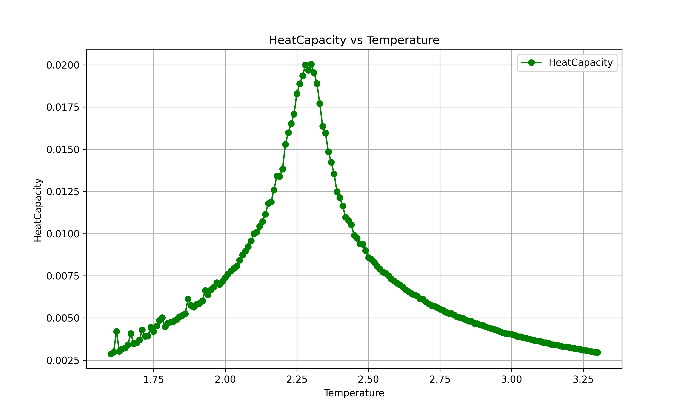
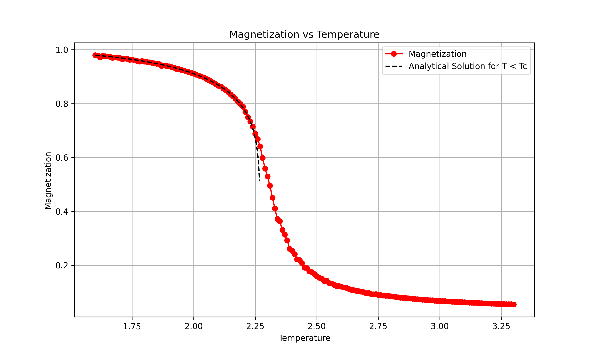

# 2D Ising Model Monte Carlo Simulation

## Overview

This repository contains a Monte Carlo simulation of the two-dimensional Ising model using the Metropolis algorithm, along with several supporting scripts for running simulations, processing results, and generating visualizations. This document details the physical and mathematical foundations of the main simulation, as well as explanations for the accompanying scripts used to manage the simulation workflow.

## Physical and Mathematical Details of the Simulation

The simulation implemented in `2D.cpp` is a classic example of studying the two-dimensional Ising model using Monte Carlo methods, specifically the Metropolis algorithm. Here, we explore the key formulas and the physics behind the main functions of the code.

### 1. The Ising Model

The Ising model considers a two-dimensional lattice of size $\( L \times L \)$, where each site on the lattice has a spin $\( s_{ij} \)$ that can take values of +1 or -1. The spins interact with their nearest neighbors and can also be influenced by an external magnetic field $\( B \)$.

### 2. Energy of the System

The total energy of the system, $\( E \)$, is given by the sum of the interaction energy between adjacent spins and the contribution from the external magnetic field. Mathematically, the energy per site is calculated as:

$E = -J \sum_{\langle i,j \rangle} s_{ij} s_{i'j'} - \mu B \sum_{i,j} s_{ij}$

where:

- $\( J \)$ is the coupling constant between spins (normalized to 1 in the code).
- $\( \langle i,j \rangle \)$ denotes the sum over nearest neighbors.
- $\( \mu \)$ is the magnetic moment associated with each spin.
- $\( B \)$ is the strength of the external magnetic field.

In the code, this formula is implemented in the function `calculate_energy`. For each site on the lattice, the interaction energy is calculated by considering the interactions with the neighboring spins above, below, left, and right. The magnetic field term is added by summing the contribution from each spin in the presence of the external field.

### 3. Magnetization

The total magnetization, $\( M \)$, is defined as the sum of all the spins in the lattice, normalized by the total number of sites:

$$M = \frac{1}{L^2} \left| \sum_{i,j} s_{ij} \right|$$

In the code, the magnetization is calculated in the function `calculate_magnetization` by summing all the spins and normalizing by the number of sites. The absolute value is taken to obtain the average magnetization.

### 4. Metropolis Algorithm

The Metropolis algorithm is used to simulate the evolution of the lattice at a given temperature \( T \). The algorithm involves the following steps:

1. Randomly select a site on the lattice.
2. Calculate the energy difference $\( \Delta E \)$ that would result from flipping the spin at that site:

   $$\Delta E = 2 s_{ij} \left( J \sum_{(i'j')} s_{i'j'} + \mu B \right)$$

   where the sum is taken over the nearest neighbors of the site \( (i,j) \).

3. If $\( \Delta E \leq 0 \)$, accept the spin flip.
4. If $\( \Delta E > 0 \)$, accept the spin flip with probability $\( \exp(-\Delta E / k_B T) \)$.

This process is repeated $\( L \times L \)$ times for each Monte Carlo "sweep", ensuring that each spin on the lattice has the opportunity to be updated.

### 5. Heat Capacity

The heat capacity $\( C_V \)$ is a fundamental quantity that measures the system's response to temperature changes. It is calculated as the variance of the energy:

$$
C_V = \frac{1}{k_B T^2} \left( \langle E^2 \rangle - \langle E \rangle^2 \right)
$$

In the code, the heat capacity is calculated as part of the thermodynamic analysis after the simulation, using the average energy and energy squared values accumulated during the simulation.

### 6. Simulation and Output

At the end of each simulation, the results are saved to a text file. This includes the temperature, average energy per site, average magnetization per site, and heat capacity. These values can be used later to study the phase transition of the Ising model, particularly to identify the critical point where the system transitions from a disordered (high-temperature) state to an ordered (low-temperature) state.

## Running the Simulation

### Prerequisites

Ensure you have a C++ compiler that supports C++20, Python 3, and the necessary Python libraries such as `matplotlib` for plotting. Additionally, Bash and `xargs` are required for running the script.

### Run the Simulation

The entire simulation workflow is managed by a Bash script that compiles the code, runs the simulation across a range of temperatures, combines the results, and generates plots and animations. The key steps are as follows:

1. **Clone the Repository**:
   ```bash
   git clone https://github.com/NPuccZ/2D-Ising-Model-simulation
   ```
   ```bash
   cd 2D-Ising-Model-simulation
   ```
2. **Make run.sh executable**:
   ```bash
   chmod +x run.sh
3. **Execute run.sh executable**:
   ```bash
   ./run.sh
Running the script allows the compilation with the command    
```bash
g++ -std=c++20 -o 2D 2D.cpp
```
If the compilation is successful the parallel execution of the code is run. The parallelization process is necessary because the temperature is a variable, then to test several temperatures it is convenient to run the algorithm simulataneously to fully use the computational power of the machine. To do so the following command is executed in the script:
```bash
seq 1.6 0.01 3.3 | xargs -I{} -P 8 bash -c './2D {} $RANDOM 0.0'
```
This command states that the executable 2D has to be run varying the temperature from 1.6 up to 3.3 with steps of 0.01, then the code is run with eight processes in parallel, the arguments of 2D are the temperature, the seed for the random number generator and the magnetic field, in this case set to zero.
For each temperature a file containg the numerical value of the energy, magnetization and specific heat is created, since it is not very easy to deal with many files a script is run that combines them into a single one, containing four columns with the values of temperature and the other thermodynamic quantities stated above. A simple python script reads and plots the variables as functions of the temperature. The last step is the creation of the animation that represent the evoulution of the system. To make the program more efficient only for three values of temperature the evoulution is animated, in particular for T=1.6, 2,3 and 3.3. Note that the temperatures are in units J/k, where J is the constant in front of the energy expression and k is the Boltzmann constant, both have been set equal to 1.
Details and results can be found in the PDF file in the repository. Results are presented for a lattice of dimension 40 x 40, it can be modified by changing the proper line in 2D.cpp, the same holds true for the number of sweeps which is kept fixed at 300000.
Note that the script will erase automatically the existing folders containing the evolution of the lattice from previous simulations, be sure to save what you need before proceeding. Also note that the generation of the animations may take few minutes to process the files.
## Results
As visible from the plot below the transition between the ferromagnetic phase and the paramagnetic phase, corresponding to the temperature where the peak is visible, is compatible with the theoretical prediction of T=2.269.

Moreover you can also appreciate the fact that the analytical solution of the magnetization for the ferromagnetic phase is compatible with the numerical results:

Look at the pdf file for further results.
## References
1] Huang, Kerson. Statistical mechanics. John Wiley & Sons, 2008. <br>
2] Organtini, Giovanni, et al. "Programmazione Scientifica Linguaggio C, algoritmi e modelli nella scienza." (2019).
